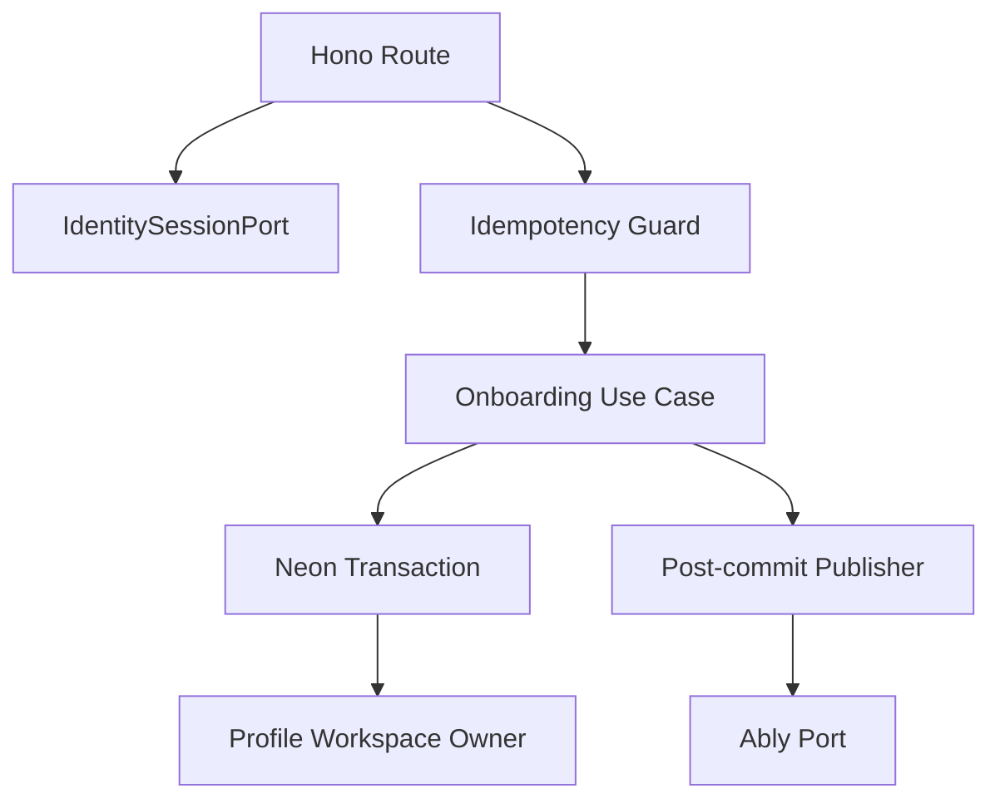

# Requirements

### Tujuan
Menghasilkan KlikFrame Phase 0 yang siap menjadi fondasi seluruh MVP dan dapat dikerjakan oleh agen eksternal seperti Claude, Codex, dan OpenCode dalam gelombang paralel yang terisolasi. Junie tidak menjadi pelaksana implementasi; perannya membekukan kontrak, menyiapkan paket delegasi, memantau laporan/bukti, dan menilai kesiapan gate.

### Cakupan
- Scaffold satu aplikasi Next.js App Router + Hono sesuai `ARCHITECTURE.md`, dengan versi Node.js, npm, TypeScript, dan Next.js exact dari `DEPLOYMENT.md`.
- Quality gates: docs/static validation, batas ukuran file, lint type-aware tanpa `any`, typecheck, unit, integration, build, supply-chain, dan secret scan.
- Boundary provider terpisah untuk Managed Better Auth, Neon, Upstash, S3/CloudFront, Resend, dan Ably; Phase 0 memberi implementasi nyata hanya sejauh bootstrap/health/contract yang diperlukan dan deterministic fake untuk test cepat.
- Migrasi awal `profiles`, `workspaces`, `workspace_members`, audit onboarding, serta penyimpanan idempotency request yang memenuhi kontrak replay/body hash `API_SPEC.md`.
- `POST /api/v1/onboarding`, auth proxy, request ID, structured error/logging, health check tersanitasi, dan fondasi token capability Ably.
- Test concurrency, rollback, replay, slug conflict, workspace state, redaction, dan isolasi dua akun bisnis.

### Di Luar Cakupan
- Fitur Phase 1+, UI dashboard lengkap, portal klien, upload, email bisnis, dan event domain selain kontrak/fake foundation.
- Team invitation, `admin`/`assistant`, Midtrans, WhatsApp, worker terpisah, AI, dan pgvector.
- Provisioning production; Phase 0 hanya menyiapkan konfigurasi dan contract smoke untuk resource nonproduction terisolasi.

### Acceptance Criteria
- Satu identity menghasilkan tepat satu `workspace` dan satu membership `owner` aktif, termasuk request concurrent dan replay dengan key sama atau berbeda.
- Key idempotency yang dipakai ulang dengan body berbeda menghasilkan `409 IDEMPOTENCY_CONFLICT`; replay valid mengembalikan body awal dan `Idempotency-Replayed: true`.
- Kegagalan pada langkah mana pun me-rollback profile/workspace/membership/audit/idempotency secara konsisten.
- Tidak ada query bisnis yang menerima `workspace_id` otoritatif dari client atau memodifikasi schema `neon_auth`.
- Semua gate Phase 0 lulus dan preview/migrasi dapat diulang.
- Setiap paket implementasi berakhir pada PR terpisah; branch tidak boleh di-merge sebelum BOT review selesai, seluruh temuan wajib terselesaikan, checks hijau, dan pengguna memberi persetujuan eksplisit.

# Technical Design

### Current Baseline
Repository lokal saat ini hanya berisi dokumen foundation, belum memiliki Git metadata maupun source scaffold, sehingga belum ada remote lokal yang dapat diperiksa. Verifikasi melalui `gh repo view msph1973/klikframe` menunjukkan repository `https://github.com/msph1973/klikframe` tersedia, kosong, belum memiliki default branch, dan akun aktif `msph1973` memiliki izin `ADMIN`. Konfigurasi global belum sesuai: `user.name` belum terpasang dan `user.email` masih `ylexrapper@gmail.com`. `ARCHITECTURE.md` menetapkan satu deploy Vercel, Hono pada `app/api/[[...route]]/route.ts`, auth proxy pada `app/api/auth/[...path]/route.ts`, serta service/use-case bersama. `DATABASE_SCHEMA.md` menetapkan transaksi onboarding serializable/advisory-lock per `auth_user_id`; `TESTING.md` mewajibkan request melewati Hono production app dan database constraints nyata.

### Struktur yang Diusulkan
- Root/tooling: `package.json`, `package-lock.json`, `.nvmrc`, `tsconfig.json`, `eslint.config.mjs`, `next.config.ts`, `.env.example`, dan `.github/workflows/ci.yml`.
- API shell: `app/api/[[...route]]/route.ts`, `app/api/auth/[...path]/route.ts`, `proxy.ts`, `lib/http/app.ts`, `lib/http/errors.ts`, `lib/http/request-id.ts`, dan `lib/config/env.ts`.
- Auth: `lib/auth/identity-session-port.ts`, `lib/auth/neon-auth-adapter.ts`, `lib/auth/server.ts`, dan `lib/auth/client.ts`.
- Data: `lib/db/client.ts`, focused schema modules di `lib/db/schema/`, checked-in `drizzle/` migrations, dan repositories per aggregate.
- Onboarding slice: `lib/onboarding/schema.ts`, `lib/onboarding/onboard-owner.ts`, `lib/onboarding/repository.ts`, dan `lib/onboarding/route.ts`.
- Providers: port/adapter modules terpisah di `lib/providers/`; realtime envelope, channel derivation, publisher, token capability, dan fake di `lib/realtime/`.
- Tests: unit co-located atau `tests/unit/`, integration Hono/PostgreSQL di `tests/integration/`, provider contract di `tests/contracts/`, serta deterministic fixtures di `tests/fixtures/`.

### Key Decisions
- Gunakan vertical slice untuk onboarding, tetapi pertahankan port provider dan database primitives sebagai modul kecil bersama; source/test menargetkan ≤400 dan gagal di atas 500 baris.
- Tambahkan `idempotency_requests` scoped oleh principal + route + key dengan request hash, response status/body, expiry, dan unique constraint. Perbarui `DATABASE_SCHEMA.md` agar kontrak data ini kanonis sebelum migration dibuat.
- Onboarding memperoleh identity dari `IdentitySessionPort`, mengambil advisory lock deterministik berdasarkan `auth_user_id`, lalu menjalankan upsert profile, create-or-load workspace, active owner membership, audit event, dan hasil idempotency dalam satu transaksi.
- Ably hanya menerima envelope allowlist setelah commit. Fake adapter menguji failure, duplicate/order/gap; browser tidak pernah menerima `ABLY_API_KEY`.
- Health endpoint hanya melaporkan status umum/request ID tanpa endpoint, secret, atau detail dependency.
- Bootstrap Git satu kali membuat baseline dokumentasi/default branch karena repository remote masih kosong; setelah itu seluruh pekerjaan implementasi wajib memakai feature branch dan PR melalui `gh`.
- Identitas Git global harus disetel ke `user.name=YLx` dan `user.email=masipah1973@gmail.com`, lalu diverifikasi sebelum commit pertama.
- Agen tidak pernah auto-merge. Setelah push, agen membuat PR, meminta/menunggu BOT review GitHub yang terkonfigurasi, menanggapi semua temuan pada branch yang sama, dan menyerahkan URL serta status checks/review kepada pengguna; merge hanya setelah persetujuan eksplisit pengguna.

### Alur Komponen

### Risiko dan Mitigasi
- **Worktree belum tersedia:** `/root/klik` bukan Git repository dan remote GitHub masih kosong; lakukan pre-Git secret/config check, set identitas global yang diwajibkan, buat baseline/default branch satu kali, pastikan `origin` persis menuju `https://github.com/msph1973/klikframe`, lalu baru buat worktree.
- **Bootstrap bukan PR:** remote kosong tidak dapat menerima PR sebelum base branch ada. Direct push awal hanya boleh berisi baseline dokumen yang sudah ada untuk membentuk `main`; scaffold dan seluruh implementasi sesudahnya tetap wajib melalui PR.
- **Konflik agen:** hanya agen eksternal pemilik fondasi/integrasi yang ditunjuk mengubah manifest, lockfile, CI, shared types, migration journal, dan Hono composition root; jalur paralel memakai file ownership eksklusif.
- **BOT review tertunda/tidak muncul:** PR tetap berstatus `review` dan tidak boleh di-merge; agen melaporkan status `gh pr checks`, review, komentar, serta blocker tanpa menganggap diamnya BOT sebagai approval.
- **Kontrak provider berubah:** semua adapter tunduk pada port dan conformance tests; raw provider values masuk sebagai `unknown` lalu divalidasi.
- **Race onboarding:** database unique constraints + advisory lock + transaction test menjadi correctness boundary, bukan in-memory mutex.

# Parallel Execution

### Model Orkestrasi
Gunakan gelombang bergate. Claude, Codex, OpenCode, atau agen eksternal lain menjalankan implementasi pada branch/worktree mereka sendiri; Junie hanya bertindak sebagai control plane berbasis repository dan laporan yang dikembalikan pengguna.

| Gelombang | Paket eksternal | Paralel | Gate masuk/keluar |
|---|---|---:|---|
| 0 | Bootstrap Git satu kali, lalu PR fondasi: scaffold, shared contracts, CI | Tidak | `main` baseline tersedia; PR fondasi BOT-approved, checks hijau, dan di-merge hanya atas persetujuan pengguna |
| 1A | PR data: schema, migration, repositories, DB fixtures | Ya | Mulai dari SHA gate 0; BOT-approved sebelum pengguna mengizinkan merge |
| 1B | PR provider: ports/adapters, Ably capability/fakes | Ya | Mulai dari SHA gate 0; BOT-approved sebelum pengguna mengizinkan merge |
| 2 | PR integrasi: onboarding Hono + auth + idempotency | Tidak | PR 1A/1B telah direview dan di-merge atas persetujuan pengguna; PR integrasi melewati BOT review yang sama |
| 3 | PR verifier/release: preview smoke dan seluruh gate Phase 0 | Terbatas | Mulai dari hasil integrasi yang disetujui; tidak auto-merge |

Pemilihan Claude, Codex, atau OpenCode untuk setiap paket tidak dikunci; gunakan agen yang tersedia. Yang dikunci adalah baseline commit, ownership file, kontrak input/output, dan acceptance gate, sehingga tool pelaksana dapat diganti tanpa mengubah arsitektur.

### Paket Delegasi untuk Agen Eksternal
Setiap prompt yang dikirim pengguna ke agen eksternal wajib berdiri sendiri dan memuat:
- goal dan acceptance criteria paket;
- absolute/relative repository path serta baseline commit SHA;
- dokumen kanonis yang harus dibaca (`AGENTS.md`, memory boot files, lalu dokumen domain relevan saja);
- daftar file/direktori yang boleh dan dilarang diubah;
- interface yang dikonsumsi dan dihasilkan, termasuk signature/type yang sudah dibekukan;
- perintah test/gate dan hasil yang diharapkan;
- larangan memasukkan secret, PII, endpoint privat, atau mengubah keputusan lintas domain;
- format laporan akhir: status, commit SHA, URL PR, file berubah, keputusan, command beserta ringkasan output, status checks/review BOT, resolusi tiap temuan, blocker, dan risiko tersisa.

### Aturan Worktree, PR, dan Review
- Satu branch/worktree per paket eksternal; gelombang paralel harus mulai dari baseline commit SHA yang sama.
- Agen eksternal tidak saling cherry-pick, tidak mengedit worktree agen lain, dan tidak langsung merge ke base branch.
- Setelah gate paket lulus, agen menjalankan push non-force, membuat PR baru dengan `gh pr create`, dan mengembalikan URL PR; satu PR tidak boleh dipakai untuk beberapa paket independen.
- Agen memantau checks melalui `gh pr checks` dan membaca review/komentar BOT melalui `gh pr view` atau `gh api`; seluruh requested changes dan temuan actionable harus diperbaiki pada branch yang sama, diuji ulang, dan dipush kembali sampai review/checks selesai. Temuan yang dianggap tidak valid harus dijawab dengan bukti teknis dan tetap dilaporkan kepada pengguna.
- Status BOT yang pending, gagal, tidak muncul, atau komentar yang belum terselesaikan memblokir merge. Tidak ada approval implisit karena timeout.
- Junie menilai laporan/diff dan memberi rekomendasi gate. Hanya pengguna yang boleh memberi persetujuan merge eksplisit; agen eksternal tidak menjalankan `gh pr merge` atau merge lokal tanpa instruksi baru tersebut.
- Worktree dan branch dipertahankan selama siklus feedback PR. Cleanup hanya dilakukan setelah PR benar-benar merged dan bukti final tervalidasi.
- Perubahan kontrak bersama dihentikan dan dilaporkan sebagai blocker; jangan menyelesaikannya dengan duplikasi tipe, migration, atau adapter.
- Jika branch induk bergerak, paket berstatus `blocked` sampai pengguna meminta agen eksternal melakukan rebase dan mengirim bukti gate baru; force-push dilarang tanpa izin eksplisit.

### Peran Monitoring Junie
- Menjaga matriks paket: `blocked`, `ready`, `running`, `pr-open`, `bot-review`, `changes-requested`, `approved`, `merged`, `failed` berdasarkan state repository dan laporan yang diberikan pengguna.
- Menghasilkan prompt handoff untuk batch berikutnya hanya setelah gate sebelumnya terbukti.
- Memeriksa overlap file, kepatuhan interface, scope, test evidence, URL PR, status checks, temuan BOT, dan bukti resolusi sebelum merekomendasikan merge kepada pengguna.
- Tidak membuat source code, commit, worktree, merge, deployment, atau menjalankan batch eksternal atas nama pengguna.
- Memperbarui plan/status monitoring saat diminta; `.junie/memory/HANDOFF.md` dan `.junie/memory/DECISIONS.md` tetap diperbarui oleh agen eksternal/integrator hanya setelah bukti tervalidasi.
- Menghemat token sesi Junie dengan menerima ringkasan terstruktur dan lokasi artefak/log, bukan transcript lengkap; muat diff atau output rinci hanya ketika gate gagal atau temuan perlu ditelusuri.

# Testing

### Strategi Validasi
- Unit/Vitest: Zod onboarding payload, canonical body hash, idempotency replay/conflict, error mapping, request ID, Ably envelope/channel/capability, dan redaction.
- Integration/Hono + PostgreSQL: request melalui app production dengan `IdentitySessionPort` fixture, migration nyata, dan transaction/constraint nyata.
- Provider contract: deterministic fakes di CI cepat; resource Neon/Auth/Upstash/S3/Resend/Ably nonproduction terisolasi untuk staging/nightly smoke.

### Skenario Kritis Phase 0
- First onboarding `201`; replay key sama/body sama; key sama/body berbeda; key berbeda/identity sama.
- Dua request concurrent untuk identity sama hanya menghasilkan satu workspace/owner; identity berbeda dengan slug sama menghasilkan conflict tanpa orphan.
- Fault injection setelah profile, workspace, membership, dan audit membuktikan rollback penuh.
- Dua identity memperoleh workspace berbeda; forged `workspace_id` diabaikan/ditolak; cross-workspace FK gagal di database.
- Session missing/expired, origin/CSRF invalid, malformed input, workspace/membership state invalid, dan error envelope tidak membocorkan provider detail.
- Ably capability subscribe-only tepat channel, expiry ≤15 menit, payload sensitif ditolak, publish failure tidak me-rollback state bisnis, dan gap berakhir pada refetch contract.
- `docs:check`, `check:file-size`, lint, typecheck, unit coverage, integration, build, audit/signature capability, secret scan, migration check, dan preview smoke mengikuti urutan `TESTING.md`.

# Delivery Steps

### * Step 1: Establish Git-ready scaffold and shared contracts
Agen fondasi eksternal menghasilkan baseline Git yang aman, scaffold exact-version, composition root, dan quality gates sebagai parent commit seluruh worktree.

- Junie menyiapkan paket handoff; pengguna menjalankannya melalui Claude, Codex, OpenCode, atau agen eksternal pilihan.
- Agen tersebut menjalankan pre-Git checks dari `TOOLING.md`, menyetel Git global ke `YLx` / `masipah1973@gmail.com`, lalu memverifikasi nilai efektif sebelum commit.
- Karena `/root/klik` belum memiliki Git metadata dan `msph1973/klikframe` masih kosong, buat baseline dokumentasi/default branch `main` satu kali, tetapkan dan verifikasi `origin` ke `https://github.com/msph1973/klikframe`, lalu buat branch/worktree fondasi.
- Buat Next.js/Hono scaffold, exact manifest/lockfile, strict TypeScript/ESLint, environment parser, request ID, error envelope, sanitized health route, auth proxy shell, dan CI workflows.
- Implementasikan `docs:check` dan explicit file-size allowlist sesuai `TESTING.md`.
- Bekukan shared interfaces untuk identity/session, transaction runner, idempotency, realtime publisher/token capability, clock/UUID, dan provider error taxonomy.
- Tambahkan unit/negative fixtures yang membuktikan `any` dan file >500 baris ditolak; jalankan install, docs, size, lint, typecheck, unit, dan build sebelum membuka batch paralel.
- Push branch fondasi, buka PR baru dengan `gh`, pantau BOT review/checks, perbaiki semua temuan, dan serahkan URL serta bukti status; jangan merge sampai pengguna menyetujuinya.

###   Step 2: Build tenancy and idempotency persistence in the data worktree
Agen data eksternal menghasilkan migration dan repository contracts yang menjamin satu owner/workspace serta replay onboarding pada concurrency nyata.

- Perbarui kontrak `idempotency_requests` di `DATABASE_SCHEMA.md`, lalu buat focused Drizzle schema modules dan checked-in migration untuk `profiles`, `workspaces`, `workspace_members`, onboarding audit, serta idempotency storage tanpa menyentuh `neon_auth`.
- Tambahkan unique/partial constraints untuk satu active owner per workspace dan satu owned workspace per identity, plus index/expiry untuk idempotency.
- Implementasikan transaction runner, advisory-lock helper, onboarding repository, migration drift/check scripts, dan two-tenant factories.
- Tambahkan integration tests untuk migration repeatability, cross-tenant FK rejection, exact/changing-key replay persistence, concurrent insert, dan rollback fault injection.
- Batasi worktree ini pada `lib/db/**`, `drizzle/**`, data fixtures/tests, dan perubahan kanonis schema yang disetujui.
- Push branch data dan buka PR tersendiri; pantau BOT review/checks, perbaiki temuan pada branch yang sama, lalu kembalikan URL PR, commit SHA, dan bukti gate tanpa merge.

###   Step 3: Build provider boundaries and realtime foundation in the provider worktree
Agen provider eksternal menghasilkan adapter contracts dan fake deterministik tanpa mengikat domain pada SDK vendor.

- Implementasikan `IdentitySessionPort` adapter untuk Managed Better Auth dan bootstrap ports untuk Upstash, storage/delivery, Resend, serta observability dengan config server-only yang tervalidasi dari `unknown`.
- Implementasikan versioned Ably event envelope, owner/portal channel derivation, subscribe-only token capability ≤15 menit, post-commit publisher port, dan deterministic fake untuk failure/duplicate/order/gap.
- Pastikan `ABLY_API_KEY` tidak masuk client bundle, payload/channel/log bebas PII/token/nominal, dan provider failure dipetakan ke typed errors.
- Tambahkan unit/conformance tests untuk session fixtures, capability isolation, expiry, redaction, malformed provider responses, timeout, dan publish failure.
- Batasi worktree ini pada auth/provider/realtime modules serta tests; jangan mengubah manifest, migration, Hono composition root, atau onboarding route kecuali pengguna membuka ulang kontrak setelah review Junie.
- Push branch provider dan buka PR tersendiri; pantau BOT review/checks, perbaiki temuan pada branch yang sama, lalu kembalikan URL PR, commit SHA, dan bukti gate tanpa merge.

###   Step 4: Integrate atomic onboarding through the Hono API
Agen integrator eksternal membuat `POST /api/v1/onboarding` memenuhi `KF-ONB-001` melalui service/use-case tunggal dan seluruh boundary HTTP/security yang ditetapkan.

- Mulai hanya setelah PR data/provider menyelesaikan BOT review, checks hijau, pengguna secara eksplisit mengizinkan merge keduanya, dan agen integrator ditugaskan dari base branch hasil merge tersebut.
- Implementasikan payload Zod, session pre-workspace, exact Origin/Host dan CSRF checks, required `Idempotency-Key`, canonical body hash, route handler, dan stable response/error mapping.
- Jalankan onboarding use case dalam advisory-locked transaction: upsert profile, create-or-load workspace, active owner membership, audit event, dan persisted replay result.
- Hubungkan route ke `lib/http/app.ts` dan Next.js catch-all tanpa menduplikasi business logic pada Server Actions.
- Tambahkan Hono/PostgreSQL integration tests untuk first request, all replay/conflict modes, slug collision, concurrent requests, rollback at each write, session/input failures, request ID, redaction, dan two-tenant isolation.
- Push branch integrasi dan buka PR baru; pantau BOT review/checks, selesaikan seluruh feedback, dan serahkan bukti kepada pengguna tanpa auto-merge.

###   Step 5: Validate the integrated Phase 0 baseline
Agen verifier eksternal mengembalikan bukti bahwa migration, aplikasi, provider boundaries, dan preview Phase 0 bekerja bersama; Junie menilai bukti tersebut untuk rekomendasi lanjut ke Phase 1.

- Jalankan full ordered gates: immutable install, docs/static checks, file-size, lint, typecheck, unit coverage, integration, build, migration generate/migrate/check, supply-chain checks, dan secret scan.
- Deploy preview dengan dependency nonproduction terisolasi; smoke auth/session, health, owner onboarding, migration repeat, Ably token capability/publish/refetch/reconnect, request ID, dan log redaction.
- Review diff terintegrasi untuk overlap worktree, forbidden scope, `any`, file-size exceptions, migration ownership, leaked secrets, serta ketidaksesuaian kontrak kanonis.
- Catat bukti tervalidasi, blocker provider/legal yang masih berlaku, dan next actions terurut di `.junie/memory/HANDOFF.md`; promosikan hanya keputusan yang benar-benar disetujui ke `.junie/memory/DECISIONS.md`.
- Push perubahan verifier/release dalam PR tersendiri, pantau BOT review dan checks sampai tuntas, lalu serahkan URL serta rekomendasi; merge tetap menunggu persetujuan eksplisit pengguna.