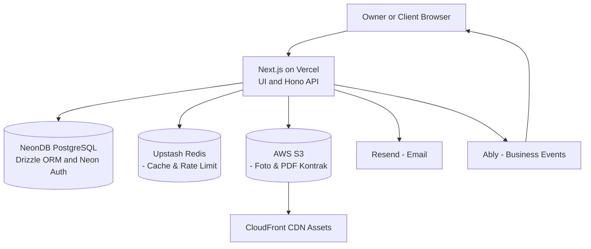
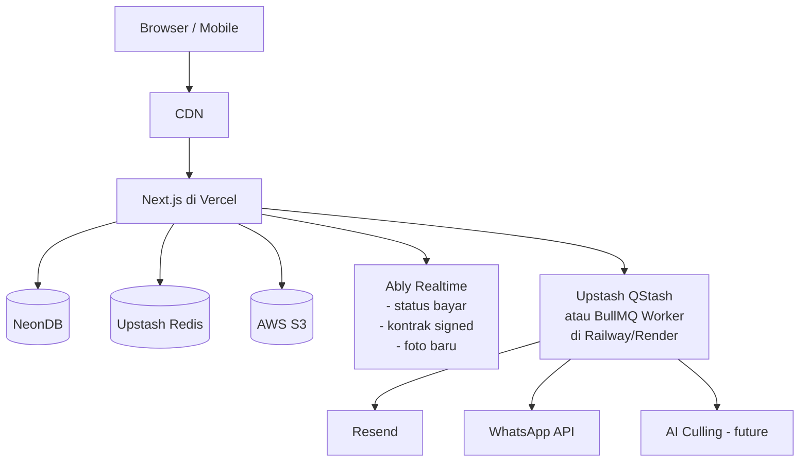

# Arsitektur Sistem — KlikFrame

## 1. Gambaran Umum

KlikFrame dibangun dengan arsitektur serverless-first. Frontend dan API utama berjalan di **Vercel** (Next.js App Router + Hono). Database memakai **Neon PostgreSQL** dengan Managed Better Auth; cache/rate limit memakai **Upstash Redis**, object private memakai **AWS S3 + CloudFront**, email memakai **Resend**, dan event bisnis realtime memakai **Ably**. `pgvector` serta worker terpisah ditunda ke Post-MVP.

> Prinsip MVP: 1 repo, 1 deploy Vercel, 0 worker terpisah. Fitur berat ditambah setelah validasi pasar.

> Bahasa produk memakai **akun bisnis**. `workspace` hanya istilah tenancy implementasi: setiap pendaftar otomatis mendapat satu workspace dan satu membership `owner`; dashboard MVP tidak memiliki undangan atau role anggota lain.

> Baseline versi MVP hanya didefinisikan pada `DEPLOYMENT.md` §1 dan dikunci exact di manifest/lockfile saat scaffold.

## 2. Diagram Arsitektur

### MVP (Fase 0–5) — Simple (S3-only)

### Post-MVP (Fase 6+) — Lengkap (S3-only)

## 3. Komponen Utama

### 3.1 Frontend & Toolchain

Versi runtime/framework mengikuti matriks tunggal `DEPLOYMENT.md` §1. Dependency lain dipilih melalui compatibility/security review dan dipin exact dalam lockfile; arsitektur tidak menyimpan matriks versi kedua.

- **App Router** dengan React Server Components.
- **Tailwind CSS 4.x** + **shadcn/ui** untuk komponen.
- **React Hook Form** + **Zod** untuk validasi form.
- PWA support untuk akses mobile.
- **Engines dan package manager:** mengikuti baseline `DEPLOYMENT.md` dan diverifikasi CI.

### 3.2 Backend API

- **Hono** berjalan di dalam Next.js Route Handlers (`app/api/[[...route]]/route.ts`), base path `/api/v1`.
- Autentikasi dengan **Neon Auth (Managed Better Auth)** via `@neondatabase/auth`; layanan ini hanya memiliki identity/session dan tidak menjadi model organisasi:
  - `lib/auth/server.ts` -> `createNeonAuth({ baseUrl, cookies.secret })`
  - `app/api/auth/[...path]/route.ts` -> `auth.handler()` (proxy semua `/api/auth/*`)
  - `proxy.ts` (Next.js 16) -> `auth.middleware({ loginUrl: '/auth/sign-in' })`
  - `auth.getSession()` di Server Components & middleware Hono untuk proteksi endpoint
  - `lib/auth/client.ts` -> `createAuthClient()` untuk sign-up/sign-in di Client Components
- **Hono `/api/v1`** adalah boundary eksternal. Server Actions hanya adapter UI ke service/use-case yang sama; aturan bisnis tidak diimplementasikan dua kali.
- Validasi input dengan Zod di semua endpoint Hono; nilai eksternal masuk sebagai `unknown`, bukan `any`, lalu di-parse sebelum mencapai domain.
- TypeScript `strict` dan lint type-aware menolak explicit/implicit/unsafe `any`. File source/test ditargetkan ≤400 baris dan ditolak CI jika >500 baris kecuali allowlist artefak non-source.

Boundary request owner: resolve session → lookup membership `owner` aktif → verifikasi workspace `active` (kecuali lifecycle terautentikasi yang disebut API) → tetapkan `workspace_id` server-side → cek resource scope → validasi input. Workspace `deletion_pending`/`deleted` tidak dapat mengakses dashboard meski session baru valid. Boundary portal: hash/resolve opaque token → expiry/revocation/scope/resource → rate limit → validasi input.

> Catatan migrasi: Dokumen versi lama menyebut NextAuth.js — sudah diganti ke Neon Auth. Env `NEXTAUTH_URL`/`NEXTAUTH_SECRET`/`GOOGLE_CLIENT_ID` tidak lagi dipakai; Google OAuth dikonfigurasi di Neon Console > Auth > Providers.

### 3.3 Database (NeonDB PostgreSQL)

- **Drizzle ORM** untuk type-safe query dan migrasi (`drizzle-kit`).
- Ekstensi **pgvector** untuk kolom `embedding` (opsional, aktifkan saat butuh fitur pencarian foto Post-MVP).
- Koneksi pooling via NeonDB serverless driver (`@neondatabase/serverless`).
- Tabel `neon_auth.user`, `neon_auth.session`, `neon_auth.account`, dan `neon_auth.verification` dikelola Managed Better Auth dan tidak dibuat migration aplikasi.
- `profiles` menyimpan profil aplikasi berdasarkan `auth_user_id`; tidak ada email login, password hash, token OAuth, atau session yang diduplikasi.
- `workspaces` menjadi batas tenant dan seluruh data bisnis memakai `workspace_id`. `workspace_members` MVP hanya berisi owner aktif yang dibuat atomik/idempotent saat onboarding.
- Composite tenant FK dan query dengan resolved `workspace_id` mencegah relasi serta akses lintas akun bisnis.

### 3.4 Cache & Rate Limit (MVP)

- **Upstash Redis** untuk rate limiting dan cache ringan.
- MVP **tidak butuh Redis khusus BullMQ**. Cukup Upstash REST API.

> Post-MVP: jika butuh antrean andal, tambahkan **Upstash QStash** (HTTP queue, tanpa server) sebagai pengganti BullMQ yang lebih sederhana, atau **BullMQ + Redis khusus** di Railway/Render jika butuh fitur lanjutan (retry, cron, batch).

### 3.5 Storage — AWS S3 Only

- **AWS S3** untuk foto galeri dan PDF kontrak (S3-only, R2 dibuang sesuai request).
- **CDN:** AWS CloudFront dengan Origin Access Control di depan S3.
- Bucket private dengan S3 Block Public Access; presigned URL hanya untuk upload dan signed CloudFront URL hanya untuk delivery.
- Versioning + lifecycle rule mengikuti matriks retensi/legal hold; enkripsi MVP memakai SSE-S3.
- Upload MVP wajib direct upload melalui presigned URL lalu finalize; metadata object berstatus `pending` dibuat sebelum upload dan menjadi `available` hanya setelah key, ownership, size, MIME/magic bytes, serta checksum lolos verifikasi.
- Database menyimpan S3 object key/metadata, bukan URL signed. URL CloudFront dibuat on-demand dengan expiry.

### 3.6 Realtime — Ably Event/Invalidation

- **Ably** adalah dependency MVP untuk event kontrak, invoice, pembayaran, galeri, dan selection. PostgreSQL serta `/api/v1` tetap sumber data kanonis; event tidak membawa snapshot domain.
- Service/use-case menyelesaikan transaksi terlebih dahulu, lalu publisher mengirim envelope versi yang hanya berisi `event_id`, `schema_version`, `event_type`, resource type/ID, dan timestamp. Publish gagal tidak me-rollback transaksi dan dicatat untuk diagnosis.
- Browser meminta token capability berdurasi pendek dari Hono. Owner hanya boleh subscribe channel `workspace:<workspace_id>`, sedangkan portal hanya channel `portal:<portal_token_id>:<resource_type>:<resource_id>` yang diturunkan server dari principal aktif.
- Subscriber memperlakukan duplicate/out-of-order event sebagai invalidation idempotent dan refetch resource melalui API. Reconnect, gap, atau provider outage juga berakhir pada refetch; polling terbatas menjadi fallback correctness, bukan jalur state kedua.
- Payload, channel name publik, log, dan metadata Ably tidak boleh memuat PII, raw token, signed URL, isi kontrak, signature, bukti pembayaran, atau nominal.

### 3.7 Background Jobs — Disederhanakan untuk MVP

**MVP (tanpa worker terpisah):**
- Kirim email (Resend) langsung dari Route Handler / Server Action (await `resend.emails.send()`).
- Retry mencatat `notification_deliveries` dengan status `pending`, `sent`, atau `failed`, attempt count, dan dedupe key.
- Pengingat jatuh tempo: pakai **Vercel Cron** (`vercel.json` crons) yang hit `GET /api/v1/internal/cron/reminders` 1x/hari dengan `CRON_SECRET` — tanpa BullMQ.

**Post-MVP (jika skala naik):**
- Opsi paling simpel: **Upstash QStash** — publish JSON ke `https://qstash.upstash.io/v2/publish/<url>` dan handle di Route Handler, auto retry & DLQ tanpa server.
- Opsi lanjutan: **BullMQ Worker** terpisah sebagai service Node.js di Railway/Render/Fly.io untuk: email massal, WhatsApp, resize/watermark, AI culling.

### 3.8 Integrasi Eksternal

| Layanan | MVP | Post-MVP | Catatan |
|---|---|---|---|
| **Neon Auth** | Wajib | Wajib | Email+password + Google OAuth (via Neon Console) |
| **Resend** | Wajib | Wajib | Email transaksional (invoice, kontrak) |
| **AWS S3 + CloudFront** | Wajib | Wajib | Foto & PDF (S3-only) |
| **Ably** | Wajib | Wajib | Event/invalidation bisnis; bukan source of truth |
| **Sentry** | Wajib production | Wajib | Error tracking dan alert |
| **Midtrans** | **Skip** | Kandidat | MVP = ledger transfer manual tanpa gateway |
| **WhatsApp API (Wablas/Fonnte)** | **Skip** | Opsional | MVP = email saja, WhatsApp cuma link manual `wa.me` |
| **BullMQ/QStash** | **Skip** | Opsional | MVP = direct send + Vercel Cron |

## 4. Alur Data Utama

### 4.1 Pembuatan Order & Kontrak

1. Pemilik membuat order di dashboard.
2. Server menyimpan data order ke PostgreSQL.
3. Pemilik memilih template kontrak.
4. Server membuat PDF kontrak dengan React-PDF, menyimpan snapshot konten dan document hash, lalu menaruh object private di S3.
5. [MVP] Sistem kirim link via **email** (Resend) + tombol "Copy link WhatsApp manual" (tanpa API).
6. [Post-MVP] Sistem kirim via WhatsApp API (BullMQ/QStash job).
7. Klien membuka opaque link yang ter-scope, membaca snapshot, memberi consent, dan menandatangani.
8. Server memverifikasi token/hash/status lalu menyimpan signature object, signer role, timestamp, IP, user-agent, document hash, dan audit event secara append-only/idempotent.
9. Setelah commit, server menerbitkan `contract.signed`; dashboard menerima invalidation dan refetch kontrak melalui API.

### 4.2 Pembayaran Invoice

**Flow MVP (tanpa Midtrans):**
1. Pemilik membuat invoice beserta item dan snapshot rekening tujuan.
2. Invoice menampilkan total, sisa tagihan, serta instruksi transfer manual.
3. Sistem kirim invoice via email.
4. Klien transfer manual, upload bukti (opsional) atau konfirmasi via chat.
5. Pemilik memverifikasi transfer lalu mencatat payment dengan idempotency key di dashboard.
6. Server menambah ledger payment dan menghitung status invoice `unpaid`/`partial`/`paid` dalam satu transaksi; status pembayaran bukan state order manual.
7. Setelah commit, server menerbitkan `payment.recorded`/`invoice.updated`; dashboard dan portal yang berhak refetch state invoice.

**Flow Post-MVP (dengan Midtrans):**
1. Pemilik membuat invoice -> server buat transaksi Midtrans, dapat `snap_token`.
2. Sistem kirim link pembayaran ke klien.
3. Klien bayar via QRIS/bank transfer/ewallet.
4. Midtrans kirim webhook ke `/api/webhooks/midtrans`.
5. Server verifikasi signature, update ledger/status invoice dan proyeksi pembayaran order.
6. Sistem kirim notifikasi (QStash + Ably).

### 4.3 Upload Galeri

1. Pemilik memilih foto untuk diunggah.
2. UI meminta presigned upload untuk album yang berada dalam workspace aktif.
3. Browser mengunggah langsung ke private S3 lalu memanggil finalize dengan checksum.
4. Server memverifikasi object dan mengaktifkan metadata di PostgreSQL; upload gagal/incomplete dibersihkan sebagai orphan.
5. Klien melihat galeri via client portal (CloudFront signed URL).
6. Klien menyimpan selection yang terkait principal token; foto tidak memiliki boolean favorit global.
7. Publish album atau perubahan selection menerbitkan invalidation ter-scope setelah commit dan client refetch state galeri.

## 5. Deployment Topologi

### MVP
- **Vercel**: Next.js app (frontend + API + cron) mengikuti baseline `DEPLOYMENT.md`.
- **NeonDB**: PostgreSQL managed + Managed Better Auth pada schema `neon_auth`.
- **Upstash**: Redis untuk rate limit/cache.
- **AWS S3 + CloudFront**: Object storage + CDN (S3-only).
- **Resend**: Email.
- **Ably**: event/invalidation bisnis dengan app dan key terpisah per environment.
- **GitHub Actions**: CI/CD (lint, typecheck, test) + `npm audit signatures`.

### Post-MVP (tambahan)
- **Railway/Render/Fly.io**: Worker BullMQ (jika pilih BullMQ) — atau **tanpa worker** jika pakai QStash.
- **Midtrans**: Payment gateway.
- **Wablas/Fonnte**: WhatsApp gateway.

## 6. Keamanan

- **Baseline MVP:** lihat matriks kanonis dan sumber resmi pada `DEPLOYMENT.md` §1.
- Autentikasi: Neon Auth (httpOnly secure cookies, `NEON_AUTH_COOKIE_SECRET`, auto hash scrypt).
- Otorisasi MVP: session → membership `owner` aktif → server-resolved `workspace_id` → resource scope. Role `admin`/`assistant` adalah Post-MVP.
- Validasi input: Zod di semua endpoint.
- Rate limiting: Upstash Redis (login 5/menit/IP, upload 20/menit/user, API umum 100/menit/user).
- Supply-chain: `npm ci` + lockfile ter-commit + `min-release-age=7d` (npm 11.10+) + `npm audit signatures` + 2FA npm.
- Scan keamanan: CodeQL, secret scan, dependency audit/provenance, dan SBOM wajib CI; scanner tambahan dapat ditambah berdasarkan risk review.
- Monitoring error: Sentry wajib pada production.
- Enkripsi: provider encryption at rest untuk database/object; `client_snapshot` historis memakai application-layer encryption dan akses diaudit.
